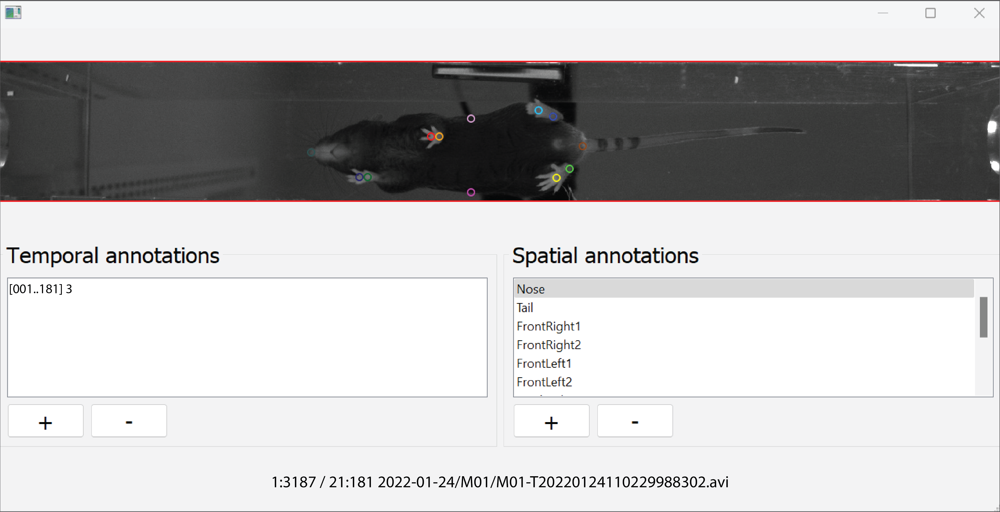

# GUI for temporal and spatial annotations of video files
Use GaitMarker to annotate time points of arbitrary events, and the x- and y-coordinates of points of interest in multiple video frames.
Data consists on a dictionary of annotations saved into  a `json` file (see data structure below). If the annotation file is in its compressed version (`json.gz`), the compression remains after saving. These data can be used in custom-scripts for further processing, for example, to train deep neural networks.



## Prerequisites
- [Python][Python] (last tested with Python 3.9)

## Installation
- Install [Python][Python]
- Install dependencies with `pip install opencv-python PyQt5 av`
- Download and extract these scripts to a local folder.

## Usage
- Run `python GaitMarker.py`
- When prompted, select:
  - A project folder with video files
  - An existing annotation file (append mode) or,
  - A new name to start a new annotation file.

The program will scan the project folder for videos. An existing annotation file may contain relative paths to videos which are expected to exist under the selected project folder. A video that is not found will not be available for annotations and its data will remain unchanged.

### Workflow
- Add a single temporal annotation to the temporal list associated to the current frame, and/or
- Add multiple position annotations using items from the spatial list
- Move to a different frame, and/or,
- Change to another video file,
- Repeat

Optionally:
- Delete annotations,
- Adjust time or location of an annotation,
- Save data while annotating (data will be automatically saved when the window is closed)

## Navigation shortcuts.
The GUI requires learning of non-intuitive shortcuts to speed up annotations with keyboard and mouse usage.

### Changing video files
- Next video: `ctrl + up/down` or  `page up/down`

### Advancing through time

#### With the keyboard
- A few frames at a time: `left/right`
- One frame at a time: `shift + left/right`

#### With the mouse wheel
Mouse pointer must be inside the temporal list.
- A few frames at a time: `scroll wheel`
- One frame at a time: `shift + scroll wheel`

### Skipping through temporal annotations

#### With the keyboard
- Next annotation: `ctrl + left/right`
- Next annotation with the same name*: `shift + ctrl + left/right`

*For any applicable filters, this shortcut will also match such filter restrictions (e.g. confidence level above/below a given threshold).

#### With the mouse
Mouse pointer must be inside the temporal list.
- Next annotation: `ctrl + scroll wheel`
- Next annotation with the same name*: `shift + ctrl + scroll wheel`
- Any annotation: `click` annotation entry

### Inserting, removing, or editing temporal annotations
These actions apply to the current frame only. Each frame may only have a single temporal annotation; attempting to add an additional annotation to a frame with an existing one will have no effect.

- Insert: `insert` or `+` button
- Remove: `delete` or `-` button
- Edit name: `F2` or `double-click` annotation
- Move annotation's frame a few frames at a time: `alt + left/right`
- Move annotation's frame one frame at a time: `shift alt + left/right`

### Selecting spatial labels
Mouse pointer must be inside the spatial list or playback panel.
- Next label: `scroll wheel`
- Any label: `click` label entry

### Skipping through spatial annotations

#### With the mouse wheel
Mouse pointer must be inside the spatial list.
- Next annotation: `ctrl + scroll wheel`

#### With the keyboard
- Not available

### Inserting, removing, or editing spatial labels
These actions apply to the selected label.

- Insert: `+` button
- Remove: `-` button
- Edit: `double-click` label

### Adding or removing a spatial annotation
These actions apply to the selected label, at the current frame only.
- Insert or move: `Left-click` anywhere in the playback panel.
- Remove: `shift + delete`

## Data structure
Output data is stored as a `json` file as in the example below:
 - `labels:` list of spatial labels
 - `entries:` list of video entries
 - `path:` relative path to video file
 - `frameId:` frame last reviewed
 - `points:` dictionary containing a list of x- and y-coordinates (`x` and `y`), with a given spatial annotation (`labels`, referred to by index in root `labels`), for a given video frame (in `frames`), and optionally the confidence associated to that annotation (in `p`).
 - `events:`dictionary containing a list of textual labels (`labels`), for a given video frame (in `frames`), and optionally the confidence associated to that annotation (in `p`).
 - `keyframes:` list of keyframe positions used for faster video playback. 
```json
"labels": ["Nose", "Tail"],
"entries":
    [
        {
            "path": "20230331-111608-211200006-C.mp4",
            "frameId": 1,
            "points":
                {
                    "frames": [4, 4, 136],
                    "labels": [0, 1, 1],
                    "x": [67.2504, 476.0070, 412.9597],
                    "y": [303.6777, 302.6269, 492.8196],
                    "p": [1, 1, 1]
                },
            "events":
                {
                    "frames": [4, 64],
                    "labels": ["label1", "label2"],
                    "p": [1, 1]
                }
            "keyframes": [0, 30, 60]
        },
    ]
```

## Changelog
See [Changelog](CHANGELOG.md)

## License
© 2021 [Leonardo Molina][Leonardo Molina]

This project is licensed under the [GNU GPLv3 License][LICENSE.md].

[Leonardo Molina]: https://github.com/leomol
[Python]: https://www.python.org/downloads/release/python-3917/
[LICENSE.md]: LICENSE.md
